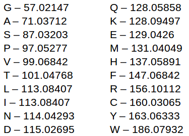
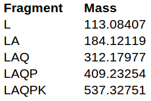
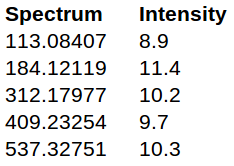
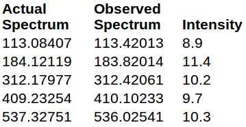
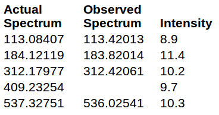
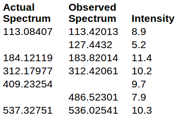

# Purpose

This is a program written to find process mass spectrometry data given MHC-I peptides. Essentially, it is a collection of heurstics to do a fast, efficient, thorough search of the mass spec data and figure out which peptide generated the spectrum. The basics of mass spectrometry are honestly difficult to explain, but I've attempted to give a brief introduction below.

This program is separated into 3 main parts: data pre-processing, data post-processing, and the search algorithm itself. 

The "main.py" file drives the program, taking the user input and executing each step as necessary.

The "backend" folder contains all pre-processing and post-processing functions, as well as functions for the data structures used by the program (each section separated into a separate subfolder).

The "scoring" folder contains the code for the main algorithm, written in C. It was translated from the original Python code in pretty short order, and it honestly has a lot of room for improvement.

Finally, the "analysis" folder contains a set of tools for analyzing the output of the program and evaluating its efficacy.

## Very Basics of Mass Spectrometry

The goal of this program is to discover new peptides. In this case, a peptide is a short protien, made up of a linear chain of amino acids. We are generally dealing with 20 amino acids. Each can be represented by a single letter and a mass:

Let's say we have a peptide, and went want to know its structure (i.e. what amino acids it is made of). Unfortunately, we can't observe this directly. But what we can do is break the peptide into many pieces, observe the mass of each piece, and try to reconstruct the peptide from those masses. That's essentially where mass spectrometry comes into play.

Let's say we have a peptide, LAQPK, and we put it into a mass spectrometer (we'll actually be putting multiple copies of the same peptide into the spectrometer). What we get out of the other end is a set of masses the instrument observed, and intensity of the mass (roughly how sure the instrument is that this is a "correct" mass rather than noise, but that is actually an very in accurate statment). The set of mass correspond to "fragments" of the peptide:

Which might generate a spectrum like this:

However, there are many problems to content with, such inaccurate measurements:

Missing data:

And random noise:

